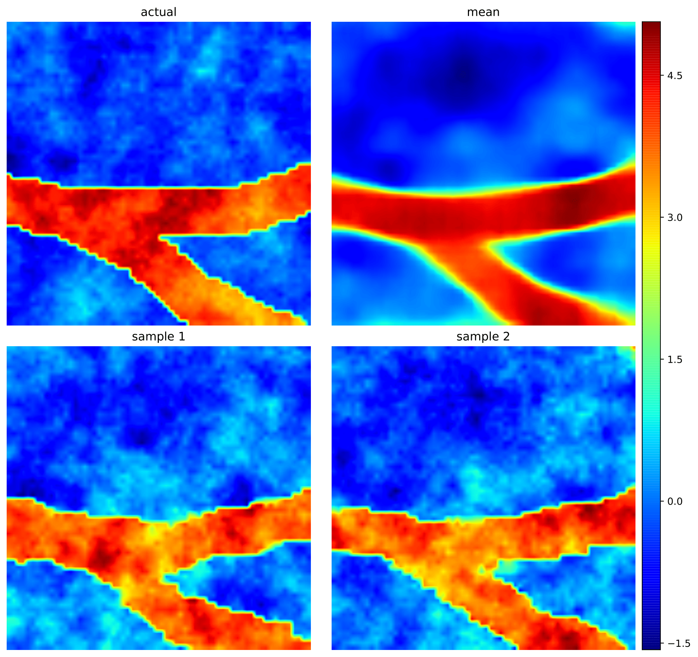

# Solving inverse problems using conditional invertible neural networks.

Solving inverse problems using conditional invertible neural networks. [JCP](https://www.sciencedirect.com/science/article/pii/S0021999121000899#se0110) [ArXiv](https://arxiv.org/abs/2007.15849)

Govinda Anantha Padmanabha, [Nicholas Zabaras](https://www.zabaras.com/)  
### Identification of the permeability field of an oil reservoir for a 2D case

This repository contains the training files for the identification of the permeability field of an oil reservoir.  

 
 

First image (first row and first column) shows the actual permeability field, second image (first row and second column) shows the mean for all the samples and the other images are samples.

## Quick Start

### Dataset
Download the datasets from this link:
https://zenodo.org/record/4631233#.YFo8N-F7mDI
### Training the inverse surrogate model

> - python3 train.py

## Contact  

Open an issue on the Github repository if you have any questions.
