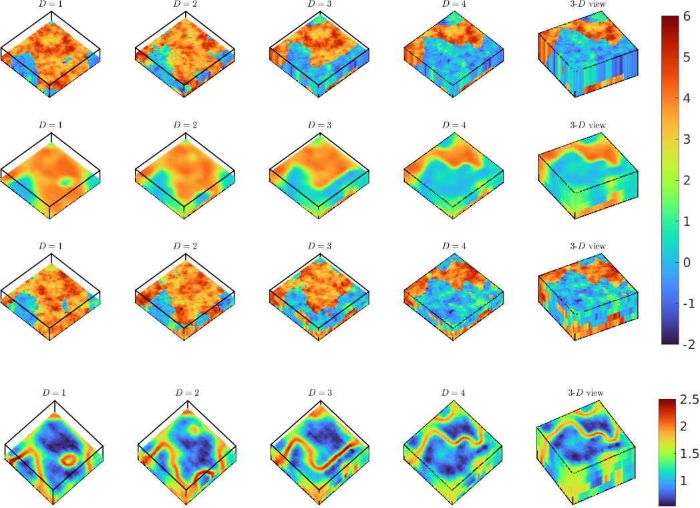

# Solving inverse problems using conditional invertible neural networks.

Solving inverse problems using conditional invertible neural networks. [JCP](https://www.sciencedirect.com/science/article/pii/S0021999121000899#se0110) [ArXiv](https://arxiv.org/abs/2007.15849)

Govinda Anantha Padmanabha, [Nicholas Zabaras](https://www.zabaras.com/)  
### Identification of the permeability field of an oil reservoir for a 3D case

This repository contains the training files for the identification of the permeability field of an oil reservoir.  

 
 

The first row corresponds to the actual log-permeability field for each depth D and a 3-D view. The second row corresponds to the mean for all the samples for each depth (D) and a 3-D view. The third row shows a sample at each depth D and a 3-D view.

## Quick Start

### Dataset
Download the datasets from this link:
https://zenodo.org/record/4631233#.YFo8N-F7mDI
### Training the inverse surrogate model

> - python3 train.py

## Contact  

Open an issue on the Github repository if you have any questions.
